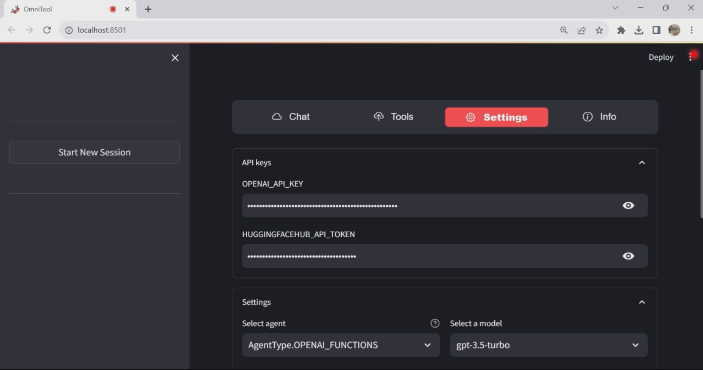
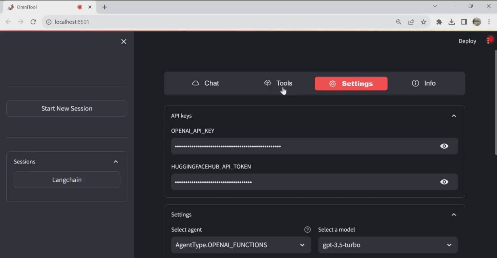

LLM Omnitool UI
=============================

A minimalistic streamlit chatbot UI to combine and customize tools for langchain llm agents. OpenAI or local quantized Llama or Mistral models can be used to power the chatbot. The simple integration of custom tools and agents gives a straightforward experience to build a chatbot adapted to one's specific needs. Custom tools can be any python function. So any call to third party agents can be integrated as a tool, from langchain, hugging face or autogen for instance, offering an endless combination of functionnalities to the chatbot. 

For an illustrative breakdown of the application's structure and flow, refer to our schema: 

<p >
  
</p>


The project integrates voice commands to push for seamless interaction and leverage vector data base for relevant document retriving. 
Advanced users can modify the project very easily thanks to its modular architecture, giving you full control to extend the chatbot functionnalities. Manage API keys, configure chatbot settings, connect it to all your custom tools and data and unleash the full potential of AI chatbot, I mean, hopefully one day, when this project, well, let's be real, when another one build a complete UI so we can just play with chatbots. In the meantime, please have a look and enjoy the ride. 

Here is a x2 speed demonstration of the app: 

[](https://github.com/americium-241/Omnitool_UI/assets/64111755/a21b731f-02c8-400f-af21-fa7962f282e4)


Summary
  -------
  
  1. **Main Features**
  2. **Customizability**
  3. **Tools showcase**
  4. **Installation Methods**
    
  -------

1. **Main Features**:
- Browse arxiv and wikipedia

- Browse web and in-app display
  
[](https://github.com/americium-241/Omnitool_UI/assets/64111755/d2666654-bb5b-4da2-93cb-b3c0d4fd0e53)


- Terminal navigation

2. **Tools showcase**:

| Autogen agents         | Stable diffusion       |
| ---------------------- | ---------------------- |
|  |  |

| Hugging face agents    | Database query         |
| ---------------------- | ---------------------- |
|  |  |

| Code                   | Run local         |
| ---------------------- | ---------------------- |
|  |  |


3. **Customizability**:

The projet is built so important features can easily be modified, such as custom: tools, agents, callbacks and config parameters.

The project tree diagram below gives precisions on which file/folder can easily be modified.

  - **Crafting Custom Agents**:
   
      Creating a new custom agent involves adding a dedicated file to the `agents_list` directory :
    
      * Navigate to `Omnitool_UI\agents\agents_list\` 
      * Create a `.py` file
      * Write a single class with an `initialize_agent` method that returns a `langchain.agents.AgentExecutor` object. 

      You can find a custom agent exemple in `agents_list` folder, or can't you ? Not so sure, you should check.     

  - **Crafting Custom Tools**:
   
      Creating a new custom tool involves adding a dedicated file to the `tools_list` directory. Here's a procedure to add a custom tool:

       - Navigate to `Omnitool_UI\tools\tools_list\`
       - Add a `.py` file in the folder 
       - Implement your tool class. If you don't need custom options, implement a simple function with a docstring and a return for          the chatbot. Files added to this folder will be automatically integrated into the app as a tool available for the chatbot.

      A sample tool class structure is provided below:
     

     ```python
      import streamlit as st
      from streamlit_elements import elements, mui, html
      import os 
      from storage.logger_config import logger
      from tools.base_tools import Ui_Tool

      class Testtool(Ui_Tool):
         name = 'Testtool'
         icon = '🌍'
         title = 'Test tool'
         description =  'This function is used so the human can make test, thank you to proceed, input : anything'

         def _run(self, a):
            # This function is executed by the chatbot when using tool
            st.success(a)
            logger.debug('During the test tool execution and with input : ' + a)
            return 'Success'

         def _ui(self):
            # This function is executed at the creation of the tool card in the tool page
            if "test_state" not in st.session_state: 
                  st.session_state.test_state = False

            def checkstate(value):
                  st.session_state.test_state = value['target']['checked']
                  if st.session_state.test_state is True : 
                     st.success('Find me at '+ Local_dir)

            # Expander placed outside (below) the card
            with mui.Accordion():
                  with mui.AccordionSummary(expandIcon=mui.icon.ExpandMore):
                     mui.Typography("Options")
                  with mui.AccordionDetails():
                     mui.FormControlLabel(
                        control=mui.Checkbox(onChange=checkstate,checked= st.session_state.test_state),
                        label="Try to change me !")
               
     ```

4. **Installation Methods**:

  **Anaconda install**
  
  1. **Clone the Repository**:
  
      Download zip file or 
  
  ```bash
  git clone https://github.com/americium-241/Omnitool_UI.git
  ```
   
  2. **Navigate to the Repository Directory**:
     
  ```bash
  cd path/Omnitool_UI
  ```
  
  Using virtual environment is highly recommanded:
  
  3. **Create a New Anaconda Environment**:
  
      Replace `your_env_name` with a name for your new environment.
  
  ```bash
  conda create --name your_env_name python=3.8
  ```
  
  4. **Activate the Environment**:
  
  ```bash
  conda activate your_env_name
  ```
  
  Requirements : 
  
  5. **Install Dependencies**:
  
      Ensure you have `pip` installed. Then, execute the following command:
  
  ```bash
  pip install -r requirements.txt
  ```
        
  Run app : 
  
  6. **Run the Streamlit App**:
  
     Once installed, initiate the application by navigating to the root directory and executing the following command to start              the Streamlit server:
     
   ```bash
   streamlit run Omnitool_UI.py
   ```
       
  **Docker-based Deployment**:
  
  For those familiar with Docker, a `docker-compose` configuration is provided for streamlined deployment:
      
  ```bash
  docker-compose up
  ```
  

     

